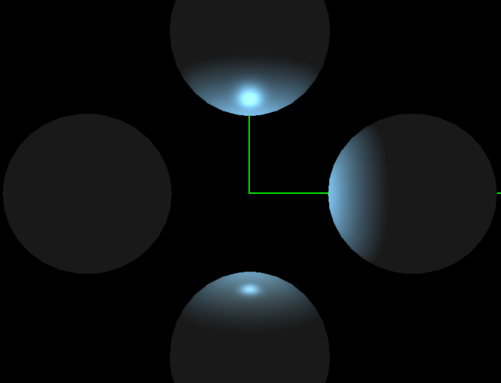
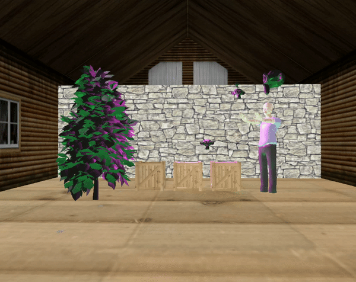

# ZPG project - OpenGL
This project was created as part of my bachelor's course and is capable of rendering 4 different scenes.

### Requirements
- GLFW, GLEW, GLM, assimp
- stb_image.h (included in the `include ` folder)

### Functionality
- usage of VBO and VAO for object loading
- shaders: constant, lambert, phong, blinn
- multiple light sources: directional, point-light, spot-light

- normal mapping and textures
- skybox
- dynamic transformations: scale, rotate, move
- stacking of transformations (ex. rotation around rotating object)

- movement along Bezier curve
- plotting colored spheres on clicked objects using stencil buffer

Scenes can be swittched in the App.cpp file.